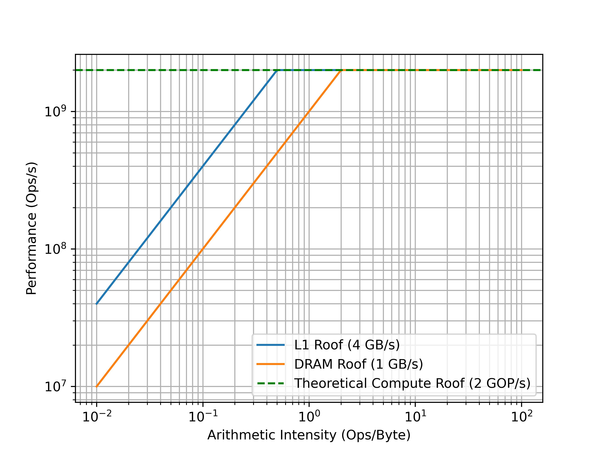
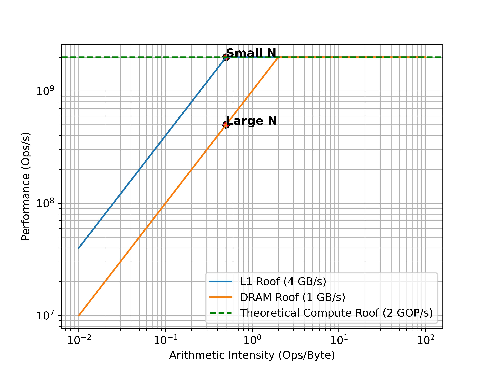
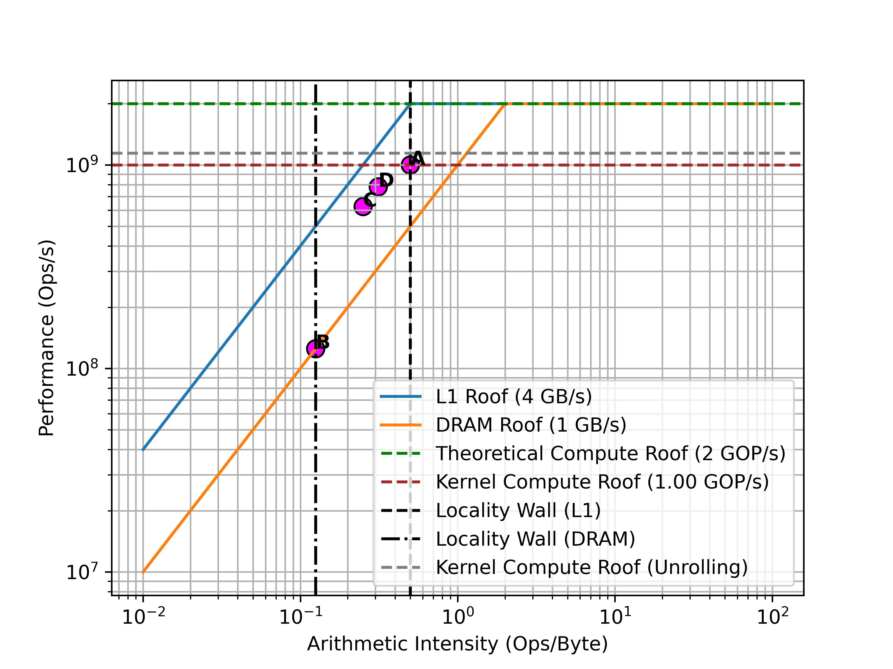

Written for a lunch and learn session at Optalysys. All cycle counts are hypothetical and just designed to illustrate the impact of different implementations/optimizations. I only mean to demonstrate how rooflines can be used to help reason about performance.

# Overview 

Roofline analysis is a generic methodology for visualising the performance of a compute kernel running on a given system.  It typically plots performance (normally expressed as some kind of operation per second e.g. FLOP/s) on the Y axis, against what is referred to as "Arithmetic Intensity" on the X axis. Arithmetic Intensity (aka Operational Intensity) is the number of arithmetic operations (eg adds, multiplies, etc) per byte of memory traffic. The general goal is to find performance ceilings in different situations, or for different versions of a kernel which may use the hardware in different ways. You can use this to optimize your program and identify which bottlenecks might be holding back performance. The whole concept is relatively flexible and you will often see very different measures of performance, and analysis is highly dependent on the system you are profiling. Hardware features such as cache sizes/latency, NUMA, and multiple cores, all have a large impact on the complexity and insightful-ness of a roofline plot.

# Case Study

Before a roofline graph makes much sense, you have to know a little bit about the system, and also what is running. Without this, concepts like "Peak performance" are totally abstract. 

To begin lets take an imaginary RISC-V CPU as an example with the following features: 
 - Its an RV32IMAC core. This means it supports integer, multiply, atomic, and compressed instructions. It does not support floating point.
 - It has a single core which runs at 1GHz
 - It has a dual issue, in-order pipeline: 
    - Two arithmetic operations can be inflight 
    - A single memory operation can be inflight. 
    - An arithmetic instruction like `add a2, a3, a4` can execute in a single cycle.
    - Given that it supports the M extension, suppose it can complete a 32-bit multiply in 1 cycle under good pipelining conditions.
 - It has 2KB of L1 cache with a bandwidth of 4GB/s (This is 4 bytes or 32bits per cycle at 1GHs, effectively a single cycle load for data in L1 cache) 
 - The rest of memory is DRAM with hypothetically unlimited space and a bandwidth of 1GB/sec (so 4 cycle load/store time) 

As a compute kernel, lets use some arbitrary vector operation that might appear in a BLAS library...

```
int A[N] = {...};
int B[N] = {...};
int C[N] = {...};

int main() {
    
    ... 

    int sum = 0;

    for (int i = 0; i < N; i++) {
        int a = A[i];            // 4 byte load 
        int b = B[i];            // 4 byte load 
        int mul = A[i] * B[i];   // 1 arithmetic operation
        int shift = mul >> 2;    // 1 arithmetic operation
        sum += shift + bias;     // 2 arithmetic operation
    }

    ... 

    return 0;
}
```
Now we can set some initial ceilings on our graph. Our peak performance is given by the clock speed (1GHz) and our CPU does a maximum of two simple integer operation per cycle (dual issue pipeline). This gives us 2 GOP/s as our best theoretical performance. From this we get a horizontal ceiling on our graph. If we had no loads/stores and stuck to single-cycle operations, this is how fast we might be able to go.

Unfortunately though, we do have loads and stores and our performance will be limited by the memory bandwidth. At any given point, our performance ceiling will be the minimum of the peak performance and the peak bandwidth multiplied by the arithmetic intensity. This is is a counter-intuitive way to say "Performance will be bottlenecked by memory, until memory is fast enough to supply all the arithmetic we are trying to do". The model of bandwidth * arithmetic intensity gives us a sloping line up to the point where peak performance is met and increasing bandwidth would no longer have an effect. This point is called the "Ridge point", and, as you can see from the graph, it is the minimum amount of "Work" possible to reach peak performance on this kernel. 



Our real performance will sit somewhere under these ceilings. For small `N` we should have plenty of space for our vector in L1 cache. We might be be to the right of the "Ridge point". We should be theoretically only be limited by our peak performance. IE, we have a *compute-bound* workload and in order to go faster we have to increase the performance somehow. On this tiny core our options are limited, but on high-performance CPUs you might consider trying to use multi-threading, SIMD instructions, etc. 

However, when N is large and our arrays no longer fit into L1, our performance will be pulled down below the DRAM ceiling. We might now be to the left of the "Ridge point" and so we are memory bound. We need to increase the ratio of arithmetic intensity to memory operations. On this core we are once again limited but on a bigger core we might try to solve this by using NUMA pragmas, or changing memory layout (see array of structs vs structure of arrays). 



Unfortunately the above interpretation is rather naive. There is a difference between the operational intensity of the algorithm we run, and the realised performance of the kernel.  

Typically, roofline analysis might consider the body of our loop to be four arithmetic operations. It is important to note that the notion of an arithmetic operation is rather abstract. On our core we said that it could do a multiply in 4-cycles. If for example we were doing a multiply on an RV32I, then this would be many many integer operations. Our imaginary core cant do floating point, but on larger HPC cores we may consider e.g. floating point addtion as single arithmetic operation. Our core is dual issue, a superscalar or out-of-order core might be able to hide a lot more of memory latency while operations are computing inside ALUs. A single issue core may be slowed down by loop overhead such as incrementing and comparing `i`. This is why it is so important to understand the hardware *and* the software. 

Practically our kernel does not stick to single-cycle instructions - we have a 1-cycle multiply and can execute two arithmetic instructions at once, but there are data dependenies on the result of the load. On top of this there is loop overhead. So it is actually impossible for us to reach our theoretical performance of 2GOP/s with this kernel since we wont be executing arithmetic at the maximum throughput. 

For a clearer picture we can consider that our "Real" ceiling has to account for instruction throughput. Our kernel does four integer operations per iteration. For the sake of argument, lets assume we can use the dual issue pipeline very effectively hiding some arithmetic operations behind the mul and load latency. Also assume we fit the arrays in L1 cache. Let's say it takes about an average of 4 cycles per iteration once pipelining is up to speed and execution reaches a steady state. Our assumed peak performance is 2 GOP/s and relies on our dual issue pipeline completing 2 operations per cycle. With 4 operations and 4 cycles to complete them, we are doing about 1 ops/cycle, or 1 GOP/s at 1GHz clock speed. Our max possible performance with this kernel is actually 1 GOP/s. This defines our "Kernel Roof".  

It is common to define many "Roofs" for different levels of abstraction and with different hardware features being utilized. EG with/without prefetching or with/without multithreading. This type of "Roof" would be considered an "In-core" ceiling, as opposed to e.g a bandwidth ceiling like our diagonal L1 cache and DRAM lines. So far we have covered diagonal and horizontal "Roofs"... But what about vertical walls?

A vertical wall would indicate a some boundary in operational intensity. In our case study, an example of these walls might represent whether we hit the L1 cache or not. When there are many cache hits, we are less memory-bound.

Wikipedia calls these "Locality walls":

>If the ideal assumption that arithmetic intensity is solely a function of the kernel is removed, and the cache topology - and therefore cache misses - is taken into account, the arithmetic intensity clearly becomes dependent on a combination of kernel and architecture. - Wikipedia

This is an important point. Obviously, performance is achieved through a combination of hardware and software effort. We cant assume they are independent.

Given that we have an access time of 1 cycle in L1 cache and 4 cycles in DRAM, we might take 6-more cycles to process an iteration where loading `A[i]` and `B[i]` are cache misses. This doesnt change the *algorithmic* operational intensity of the kernel, However, it does change our *effective* intensity, and is a much more realistic model.  

Point A on the graph represents a run where all loads are cache hits. We are at our "Kernel Roof" ceiling and our performance is at its best (for this implementation).

When we get cache misses, our *effective* arithmetic intensity reduces. In our case, if every load missed L1 we would spend it would then have to be fetched from DRAM which takes 4x as long. For simplicity we can model this as more bytes transferred. This gives us a new arithmetic intensity of 4 operations / 32 bytes. Point B represents a run like this, it is memory bound by the DRAM ceiling. 

The Locality walls can now help us understand how many cache misses we are getting. Point C shows a run where half the loads hit the cache. 



Ultimately when you measure performance, the presence of these different boundaries helps you to diagnose why your performance may be lower than you expect. Which walls you are between and which ceilings you are above/below can help you understand what is happening in your program. It might not tell you *specifically* but the goal is to provide high level insight into how well the kernel utilizes the system. You can use this to classify different implementations of an algorithm, compare different applications, or gain hints about what needs to change to reach a new performance ceiling. We can begin to quantify how far off we are from "optimal".  

Finally, consider if we unrolled the loop and loaded the next A and B elements while the previous were processing. This may only take about 7 cycles with 16 bytes loaded. We might be hiding more load latency behind more arithmetic operations, improving the realised locality of the loads. Since we have a better ratio of useful operations to cycles spent, this raises our kernel roof.

Point D shows an example run of the unrolled loop with a cache hit rate of 50%. It is much better than C which had a similar hit-rate but was not unrolled, but note how performance is still lower than A - a simple kernel with 100% cache hits. Caching is important!   

