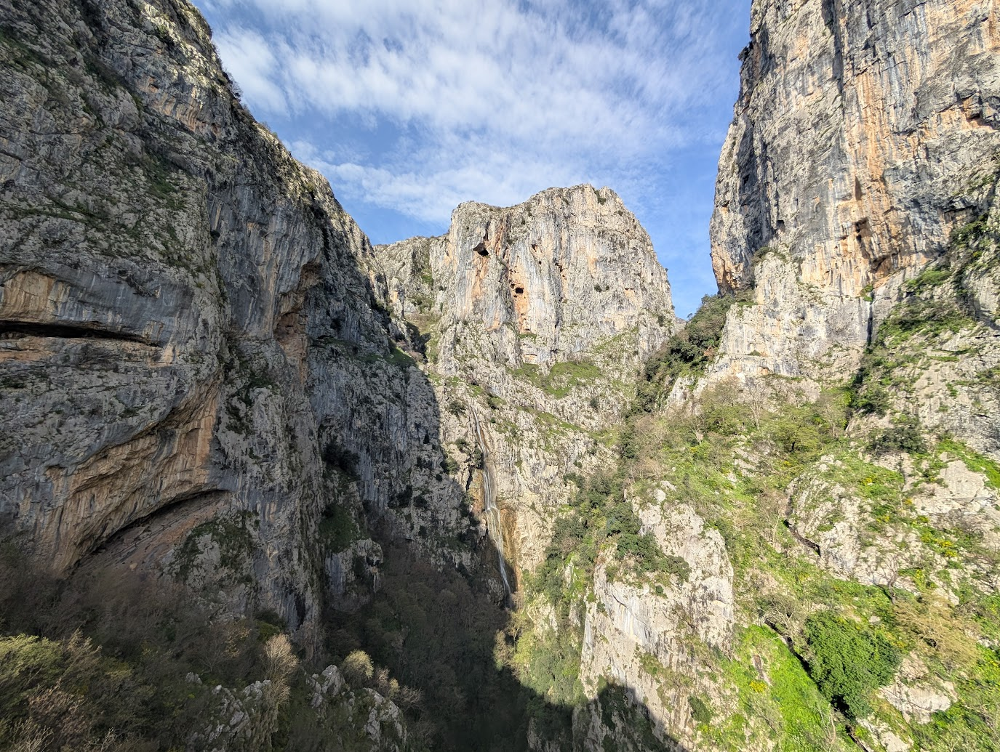
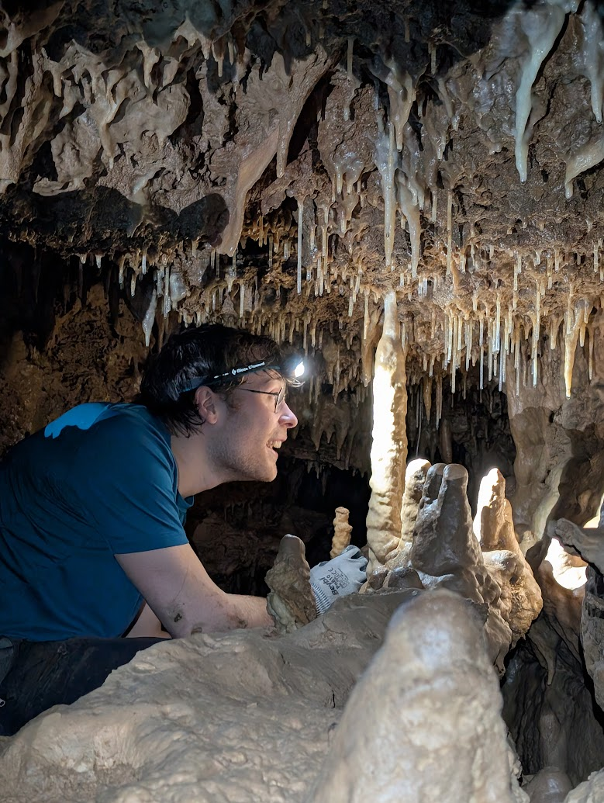
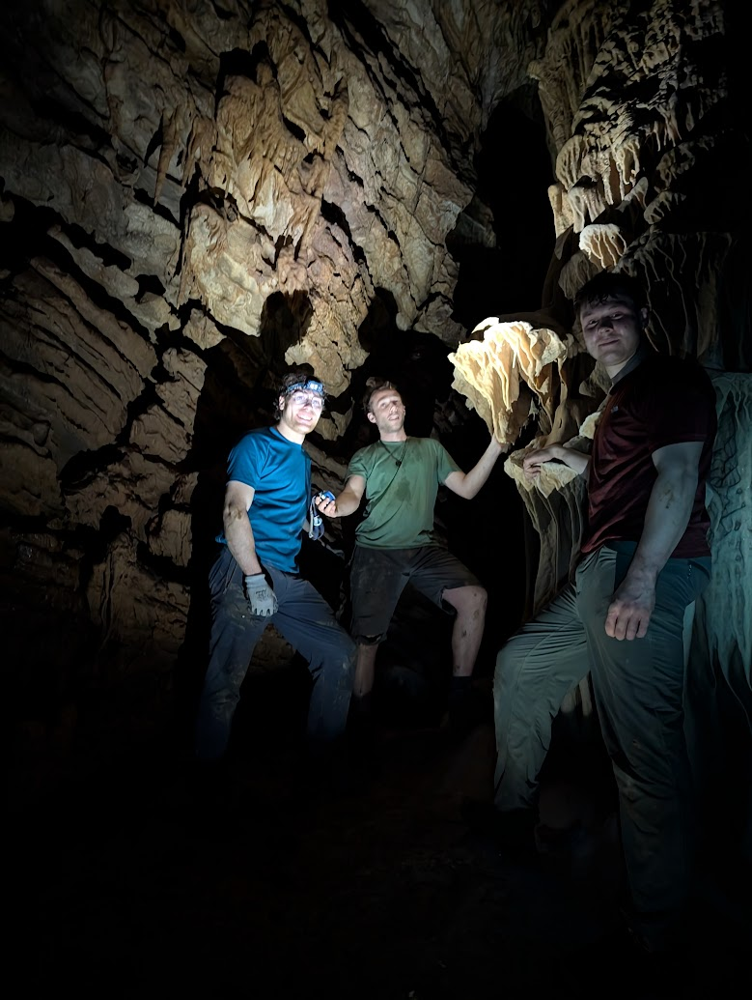
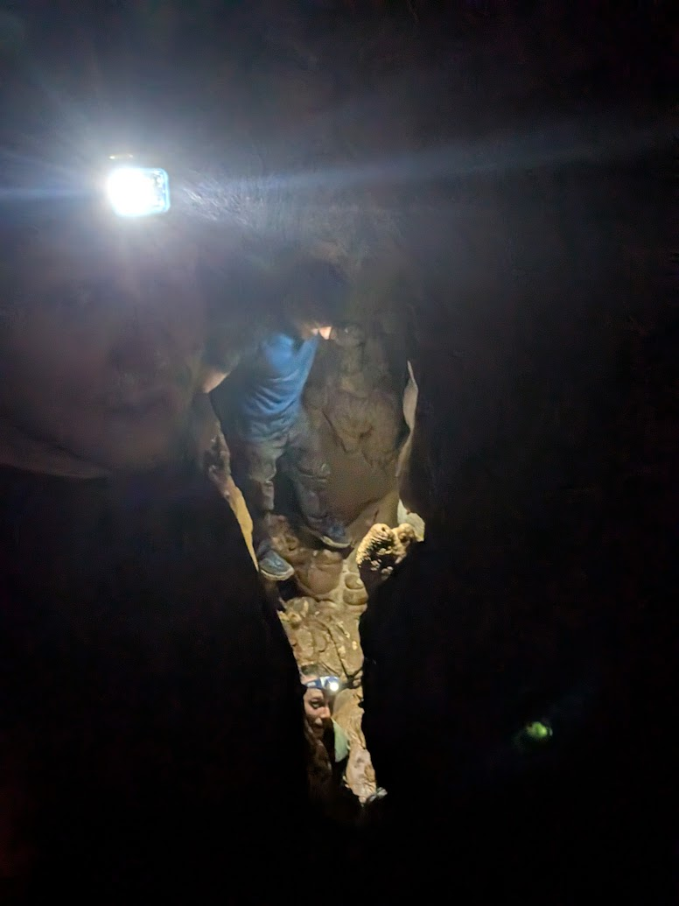
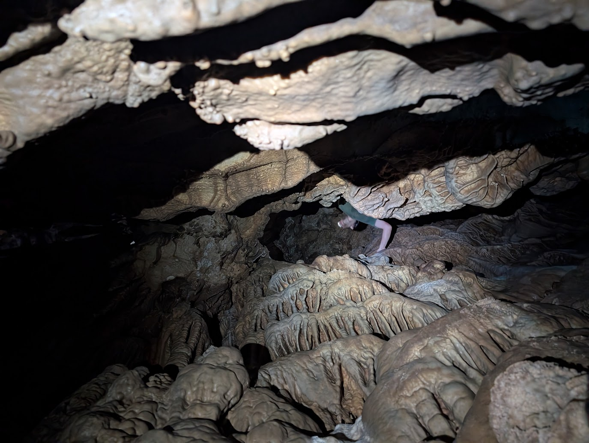
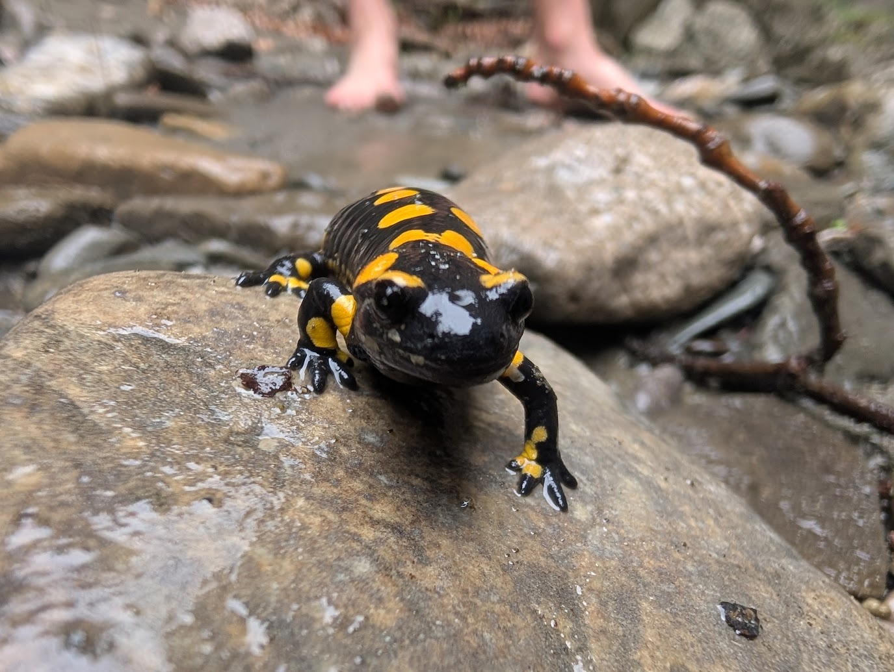
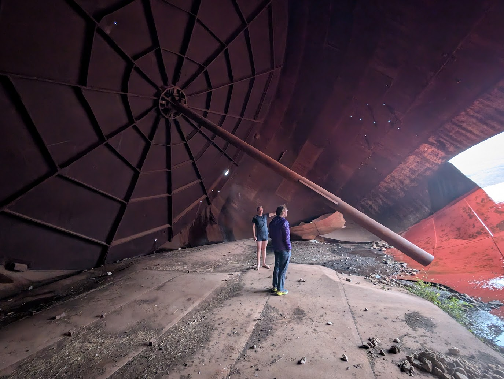
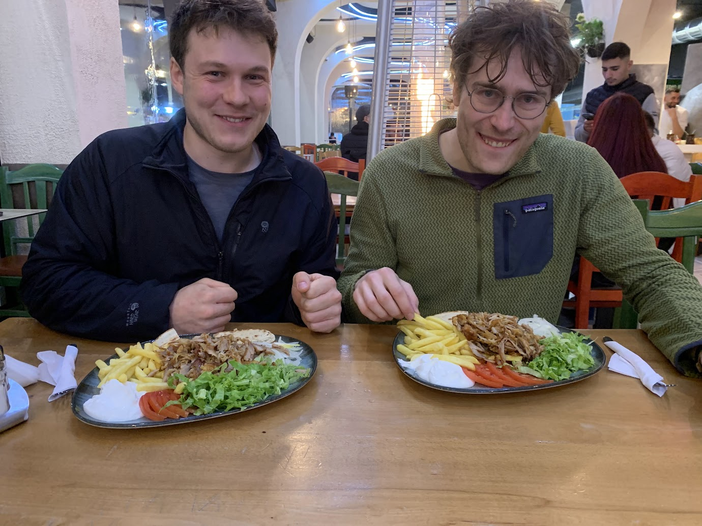
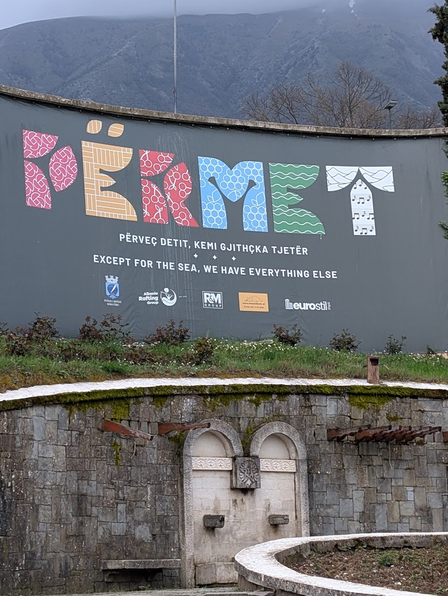

We had planned a sport climbing trip to Albania for a week in April 2025. Unfortunately the albanians had scheduled a nation-wide rain storm for every day we were there. In the whole week we climbed a total of 4 routes, to which I did not even contribute a single clean send. 

Instead we road tripped around, eating in total around 30 gyros wraps, an unknowable quantity of burek, blocked 5 toilets, and potentially became he first people in a particular chamber of an obscure cave. 

The one (mostly) sunny day was our first day in Tirana, which we spent in an underground bunker learning about torture and fascist work camps. 

The bad weather did mean we managed to see alot of beautiful orthodox churches.

# Caving With Kastrioti

We stayed at a homestay in Permet. Our host, Kastrioti, saw our climbing gear and must have mistaken us for cavers. He offered to take us to a cave which he said only he and people from his village knew about. To reach the cave we drove into the hills, then scrabled along steep slopes through bushes and trees above a gorge. Clearly this was not a well travelled route. Eventually we came accross a small opening a few feet wide and about one foot high. Kastrioti crawled in and we followed. 

The light faded, and with headtorches on we crawled through some small chambers where we were the cavern split. Kastrioti looked around, apparently a little confused, and made a cairn by our exit route. This was not reassuring. 

The main chamber was fantastic though and featured some beautiful rock. 

The general area was definitely popular with cavers and we saw several groups exploring the more serious caves. Kastrioti told us only about 20 people had ever been inside this cave, and only ever with him, but he hadn't been in for quite a while. 

There are neolithic remains in some of the caves, some of which unfortunately were looted during the covid pandemic. We saw the aftermath of this looting in a larger cave later on . Kastrioti said the locals are much more cautious about revealing the location of certain caves now. 

We explored a bit more and eventually saw a chimney upwards. I scrambled towards it but Kastrioti said it was too dangerous and noone had ever been up there. It didnt look so bad so I carried on up and eventualy got to a small chamber with more beautiful rock formations. The chamber was about three meters wide and 4 meters long. Kastrioti realised it wasnt too dangerous and scrambed up after us. He said we were the first people ever in this section. 

# Other Photos 

We saw lots of interesting animals in albania, but this guy was the coolest. 

There are lots of abandoned bunkers and buildings, but we couldnt resist exploring these giant silos. We were in our pants after a particularly wet walk. 

 

Some of the homestays had particularly interesting shampoo options. 

Gyros and kebabs can be obtained pretty much anywhere for the equivalent of about £2. 

All towns should be given slogans. Permet has the best. 

