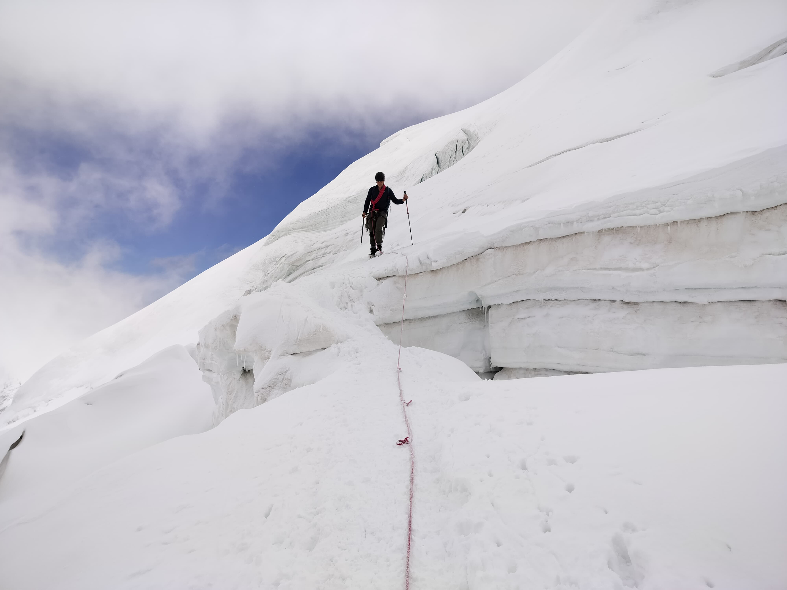
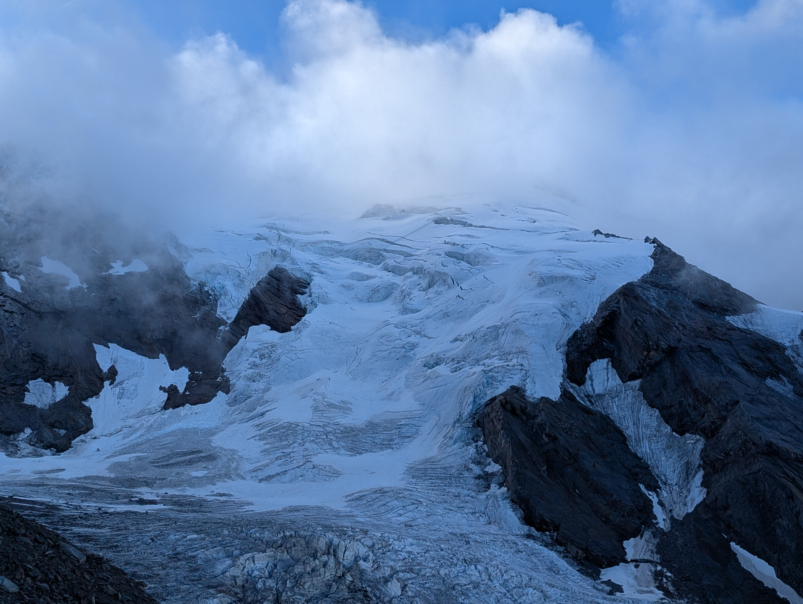
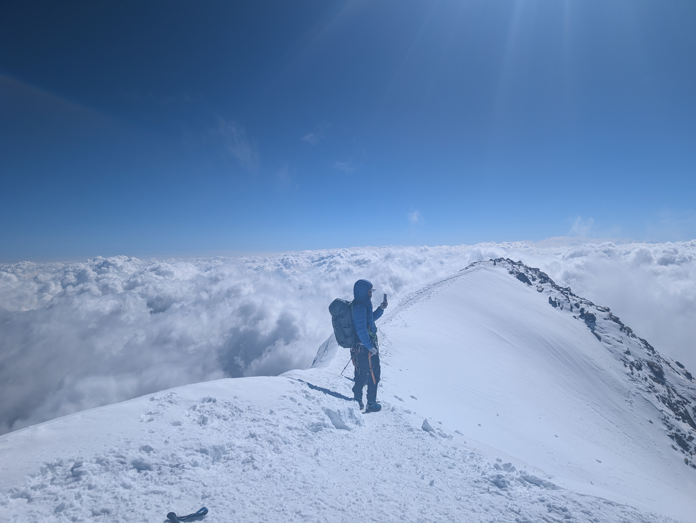
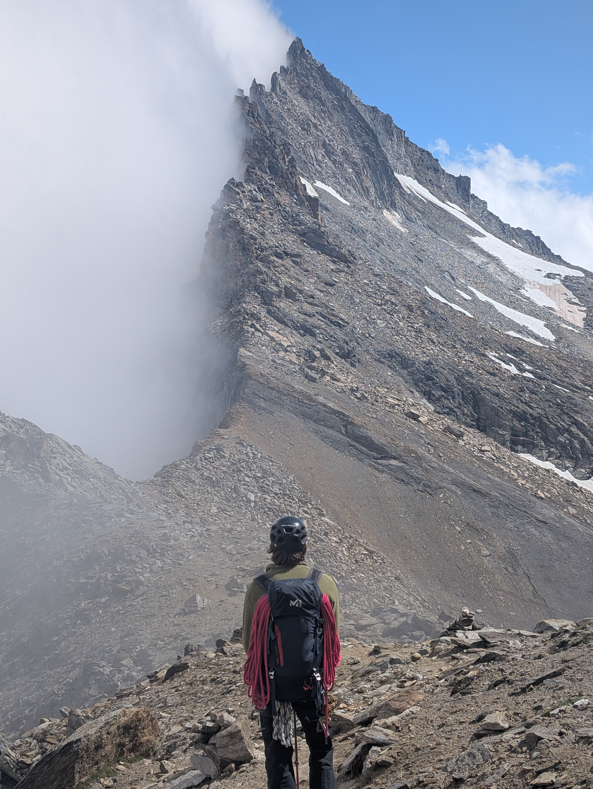
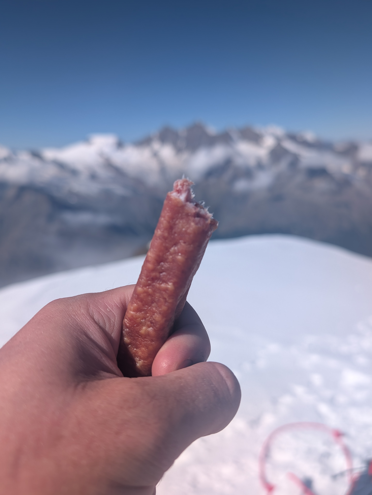
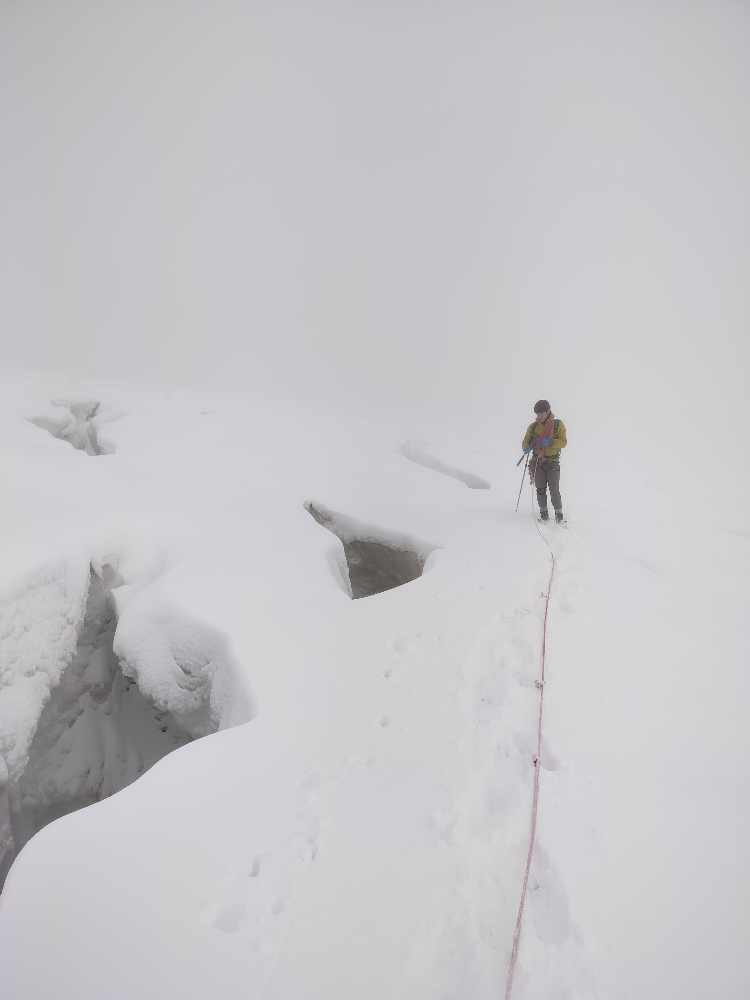
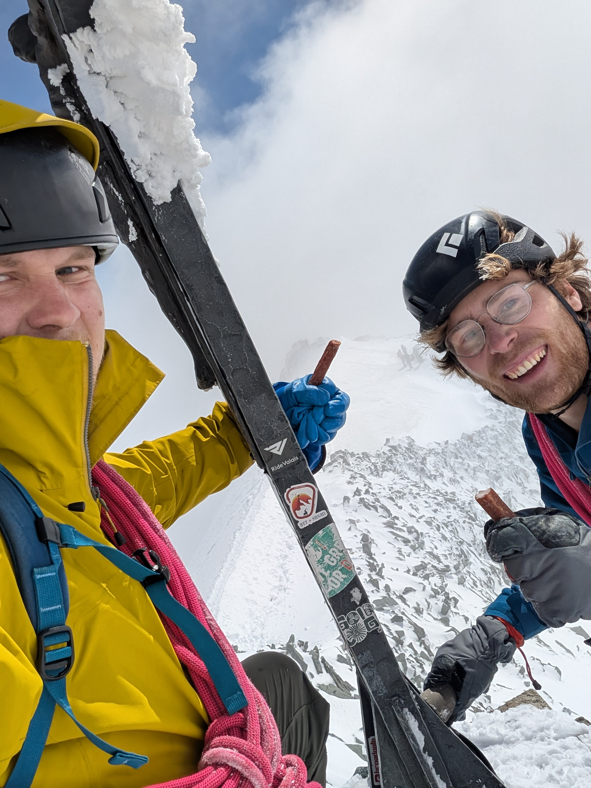
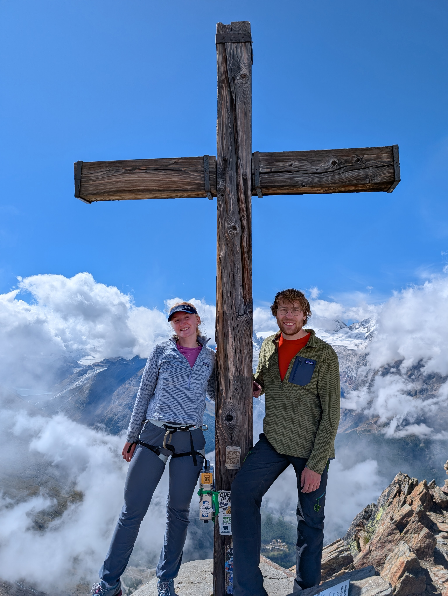

The main trip this summer was two weeks staying in Saas-Grund. It was my first introduction to alpinism. We were pretty lucky with the weather and managed to get a fair few routes done in the two weeks we were there. 

I am very grateful to Nathan in particular for doing most of the route planning and teaching various skills. Without this I wouldnt have had the confidence to do very much. 

The summits/routes I completed were:
- Alalinhorn NW Face (Normal Route) + most of the Feechopf ridge. 
- Lagginhorn West Ridge 
- Weismies Northwest Flank (Normal Route) 
- Weissmies SE ridge (In descent) 
- Dri Horlini Traverse 
- Alalinhorn via Hohlaubgrat route 

As well as this we did the Jegihorn Via Ferrata with bridge, and a brilliant 14-pitch sport route up the Jegihorn called Alpendurst. 

Gabe and Nathan also did the Nedelhorn and some other ridges. 

I have summarised a few of my favourites below.

# Weissmies

 

Katharine, Nathan and I did Weissmies as a three. The first section glacier was busy and I found the main steep icy slope to be quite scary, but once you are above that it is a long but pleasant snow plod to the top. 

The descent down the SE ridge is extremely chossy on top, and not easy to navigate. You eventually get to a beautiful coll, and from there it is a pleasant walk to the Almageller hut, or a brutal 5 hour slog to Saas Almagel. We opted for the former so that we could try the Dri Horlini the next day. 

# Dri Horlini 

I dont have many photos of the Dri Horlini, mostly because it was a total faff as a group of three with only a single 50m rope. That being said, the route is great fun with some fairly technical sections. Some of the downclimbs are particularly interesting when you arent used to fumbling for footholds in B2 boots. 

# Hohlaubgrat route

This was the last, but one of the best routes we did. It begins from the halfway station on the train in the mountain. We were late in the season so the crevasses were opening up. It had also snowed the night before covering the crevasses. The visibility was terrible too. this made the route finding across the flat section of glacier feel a little bit creepy. Nathan lost a leg down a crevasse at one point, and we had to jump over several others. 

Once we climbed out of the cloud and onto the ridge we had a section of good snow plodding and then a short climb to the summit. The climbing has been overly protected by steel chains, but its still good fun. 

# Jegihorn 

Jegihorn was actually my favourite summit. The view is great and you can sit there for a while comfortably. 

The via ferrata is pretty good fun but the best way up we found was the Alpendurst sport route. It took us about 3 hours to climb the 14-pitches of 5c/5a (at its hardest) climbing. 

