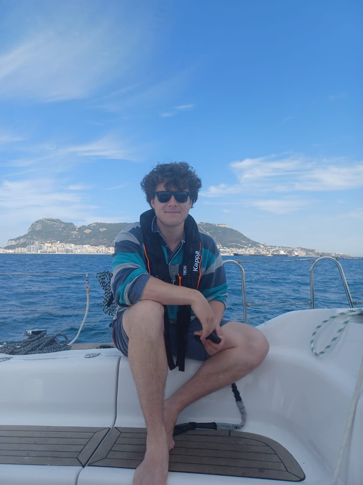
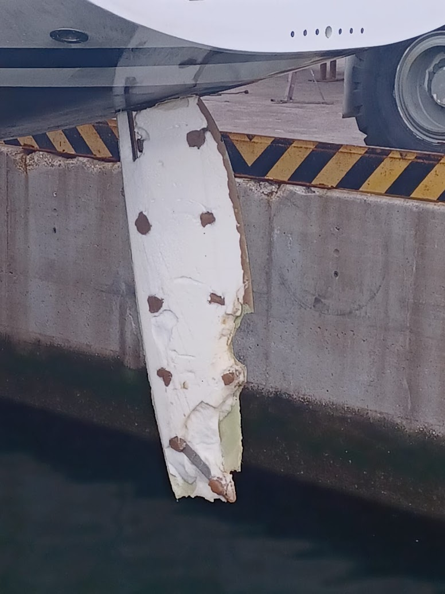

On a sailing delivery job we were attacked by four orca whales in the Gibraltar strait. There were three juveniles and an adult - perhaps Gladis herself. 

It was a very calm night at about 22:00. I was on watch motoring along having passed Terife around sunset. After a thud I initally thought I had hit a lobster pot, so put the boat into neutral and peered from the stern to see if I could see any lines tangled in the propeller or rudder. As I leant with my torso over the stern - perhaps two feet from the water - the huge beast emerged from the dark sea and, now illuminated by the stern light, seemed to meet my eyes. 

The orcas slammed into the hull for hours, spinning us around. We initially made a pan-pan radio call to alert other boats and tried to wait it out. It did not last long however, and we had to request a rescue from the Barbate coast guard once the orcas ripped away the rudder and destryed the mechanism of the boats steering cables.

We were being towed in very quickly by the coast guard vessel, but the orcas gave chase andseemed to have great fun swinging us around having bitten on to the remaining fragments of rudder. The whole ordeal lasted four or five hours. 

Due to the darkness (and fear) I was not able to get much good footage, but in the video below you can see an outline of one of the smaller orcas briefly as it is caught in the searchlight of the incoming coast guard boat. 

<iframe width="100%" height="400"
  src="https://www.youtube.com/embed/CoLPEO-AH9c" 
  title="YouTube video player" frameborder="0" 
  allow="accelerometer; autoplay; clipboard-write; encrypted-media; gyroscope; picture-in-picture; web-share" 
  allowfullscreen>
</iframe>

